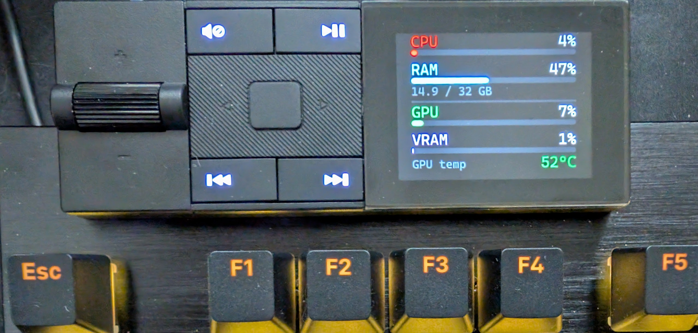

# keyboard-stats

Displays live system stats on the be quiet! Dark Mount keyboard's media dock LCD, updated every 20 seconds.



Shows: clock, CPU %, RAM % + usage, GPU %, VRAM %, GPU temperature.

## How it works

A Node.js script generates a stats image as a PNG, then uses browser automation (Playwright + Chromium) to upload it to the official [be quiet! IOCenter web app](https://iocenter.bequiet.com/), which pushes it to the keyboard over WebHID.

## Requirements

- Windows (GPU stats use PowerShell performance counters)
- Node.js 18+
- A be quiet! Dark Mount keyboard
- NVIDIA GPU recommended — GPU %, VRAM %, and temperature are read via `nvidia-smi`. The display degrades gracefully if it isn't found (CPU and RAM still show).

## Installation

```
npm install
npx playwright install chromium
```

## First run

On first run the browser needs to connect to the keyboard. WebHID requires a one-time manual approval that can't be automated:

```
node automate.js
```

1. The browser will open and navigate to iocenter.bequiet.com
2. If prompted, dismiss the welcome popup
3. When you see "No Device detected", the script will click **Find Device** automatically
4. Select your keyboard in the browser's HID picker and click **Connect**
5. The script takes over from here — the browser minimises and runs in the background

The keyboard permission is saved in `.chromium-profile/` so subsequent runs are fully automatic.

## Normal usage (background)

Double-click `start-background.vbs`. A browser window will briefly appear while it connects to the keyboard, then automatically minimise to the taskbar. Stats update every 20 seconds from that point.

Logs are written to `automate.log`.

To stop: end the `node.exe` process in Task Manager, or run:
```
taskkill /f /im node.exe
```

To check on it or intervene, click the Chromium icon in the taskbar or open `http://localhost:9222` in any Chrome window for remote DevTools.

## Configuration

Edit the top of `automate.js`:

```js
const INTERVAL_MS = 20_000; // update interval in milliseconds
```

## Disclaimer

This project automates the official be quiet! IOCenter web interface. It is not affiliated with or endorsed by be quiet!. Use at your own risk — web automation may break if the site is updated.
